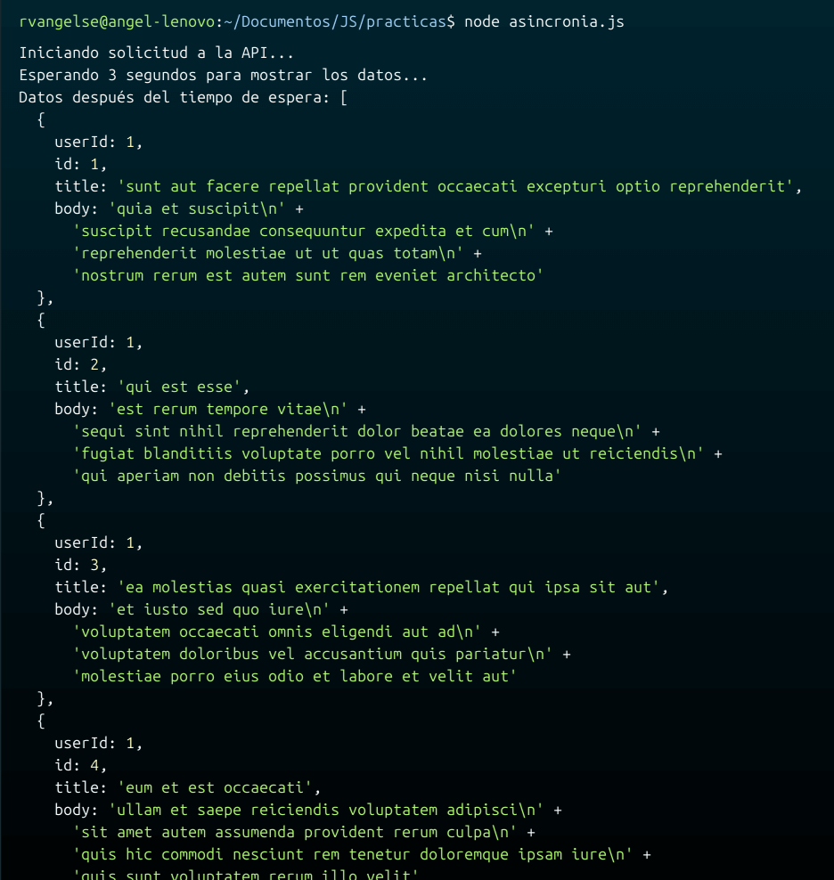

# Asincronía

**¿Cómo funciona el JavaScript Engine?**

JS Engine se divide en 2 partes:

* **Memory Heap:** Es donde se almacenan las variables, funciones, objetos, etc. que creamos. 
  
* **Call Stack:** Es la pila donde se guardan cada una de las funciones que debemos ejecutar cuando corremos nuestro programa. 
   
JS funciona de forma sincrona, ejecuta una tarea a la vez, es decir, desapila las tareas una por una. 

Pero, existen formas de hacer que funcione de forma **asincrona** (Esperar un temporizador, hacer una petición HTTP, etc.), 
utilizando **Web APIs**.

Estas Web APIs permiten delegar tareas fuera del JS Engine. Una vez que la tarea asíncrona termina, su callback se coloca en la **Task Queue** (cola de tareas).
El **Event Loop** es el encargado de verificar si la Call Stack está vacía y, en ese caso, mover tareas desde la Task Queue a la Call Stack para que puedan ejecutarse.

## Temporizadores

### Temporizador: setTimeout
```js
//Se ejecuta en t = 1
console.log('antes');

//Se ejecuta en t = 3
//Formato (Función, tiempoDeEspera)
let timeout = setTimeout(()=>{
    console.log('Cualquier código');
},3000); 

//Se ejecuta en t = 2
console.log('después');

//Cancela la ejecución del setTimeout()
clearTimeout(timeout);
```
OJO: `setTimeout` no garantiza la ejecución de tu código, despues de un tiempo exacto, simplemente pone tu código en una cola para ser ejecutado después del tiempo establecido. Si hay otras funciones en la cola, `setTimeout` tendrá que esperar su turno, lo cual podría resultar en un retraso.

### Temporizador: setInterval
```js
let i = 0;
console.log('antes');

//Este código se repite cada 2000 ms
let interval = setInterval(()=>{
    console.log(i++);
}, 2000);

console.log('después');

/*Antes, del tercer ciclo se cancela la repetición.
Es decir, se imprime en el t = 2s y en el t = 4s, pero en el t = 5s, se detiene.*/
setTimeout(()=>{
    clearInterval(interval);
}, 5000);
```
OJO: Asegúrate de siempre desactivar el temporizador con `clearInterval` una vez que ya no lo necesites.

## Promesas

Una promesa es un objeto que representa la eventual finalización (o falla) de una operación asíncrona.

Tienen 3 estados: 
   - **Pending:** La promesa aun no ha sido resuelta o rechazada.
   - **Fulfilled:** La promesa ha sido resuelta con un valor.
   - **Rejected:** La promesa ha sido rechazada con un error. 
```js
//Ejemplos, simulando una petición:

//Ejemplo 1:
const promesa = new Promise((resolve, reject) => {
    setTimeout(() => { 
        if(Math.random() > 0.5){
            resolve("Promesa resuelta con éxito"); 
        } else {
            reject("Promesa rechazada por error"); 
        }
    }, 2000);
});

promesa.then((successMessage) => {console.log(successMessage);}); 
promesa.catch((errorMessage) => {console.log(errorMessage);}); 

//Ejemplo 2: 
//En este caso, resuelve (reciboDatos)
let promesa = new Promise((reciboDatos, noReciboDatos) => {
    setTimeout(()=>{
        reciboDatos('datos');
    }, 5000);
});

promesa
    //Si resolve (reciboDatos)
    .then(texto => texto.toUpperCase()) //Convierto a mayúsculas los datos que recibí
    .then(texto => texto + '!!!') //Agrego '!!!'
    .then(texto => console.log(texto)) //Imprimo en consola
    //En caso de reject(noReciboDatos), imprimo el problema

    .catch(problema => console.log('Error: ' + problema))
    //Pase lo que pase imprimo 'Todo Listo!' 

    .finally(() => console.log('Todo Listo!'))

//Esto se ejecutará antes que la promesa
console.log('Quiero ejecutar lo más pronto posible');
```
### Múltiples promesas

```js
let promesa1 = new Promise((reciboDatos, noReciboDatos) => {
    setTimeout(()=>{ reciboDatos('datos1'); }, 5000);
});
let promesa2 = new Promise((reciboDatos, noReciboDatos) => {
    setTimeout(()=>{ reciboDatos('datos2'); }, 2000);
});

Promise.all([promesa1, promesa2])
    //Obtengo 2 resultados, si las promesas pudieron resolverse
    .then(([resultado1, resultado2])=>{
        console.log(resultado1); //Imprimo un resultado
        return resultado2; //Retorno el otro para procesarlo
    })
    .then(resultado2 => {
        console.log(resultado2.toUpperCase()); //Imprimo el resultado que faltaba
    });
```
OJO: `Promise.all()` no se ejecuta hasta que todas las promesas se procesen.

## Funciones async
Es una forma óptima de trabajar con promesas, soluciona el tener muchos `.then()` anidados.

```js
let promesa = new Promise((reciboDatos, noReciboDatos) => {
    setTimeout(()=>{
        reciboDatos('datos');
    }, 5000);
});

async function asincrona() {
    let resultado = await promesa; //Cargo el resultado de la promesa 
    console.log(resultado.toUpperCase()); //Proceso el resultado
};

asincrona();
```
## Manejo de errores

```js
try { //Código que intentaremos ejecutar
    let objeto = {};
    console.log(objeto.c.a);
} catch (error) { //Código que se ejecutará si capturamos un error
    console.log('Error: ' + error);
} finally { //Código que se ejecutará pase lo que pase
    console.log('finally');
}

//Ejemplo: 
function divide(a, b) {
    try {
        return a / b;
    } catch(error) {
        console.log('Error:', error);
    }
}
```
## Fetch WebAPI
Permite hacer peticiones HTTPs, funciona solo en navegadores(web). Existen bibliotecas de JS como `axios`, compatibles con `NodeJS`.

```js
const url = 'https://jsonplaceholder.typicode.com/users/1';

fetch(url) //Realizo la petición HTTP al url

//Si la promesa se resuelve:
    .then(response => response.json()) //Transformo la respuesta en .json
    .then(data => console.log(data.name)) //Proceso la respuesta
//Si no:
    .catch(error => console.error(error));

//Ejemplo usando fetch(), de forma asincrona:
async function reciboDatosAPI(){
    try { 
        const response = await fetch( "https://rickandmortyapi.com/api/character"); 
        const data = await response.json(); 
        console.log(data); 
    } catch (error) {
        console.log(error);
    }
}

reciboDatosAPI();

//For await of (Sirve para hacer mas de una peticion de forma asincrona)

const urls = ["https://rickandmortyapi.com/api/character", 
              "https://rickandmortyapi.com/api/location",
              "https://rickandmortyapi.com/api/episode"];

async function reciboMultiplesDatosAPI(){
    try {
        for await (let url of urls) {
          let response = await fetch(url);
          let data = await response.json();
          console.log(data);
        }
    } catch (error){
        console.log(error);
    }
}

reciboMultiplesDatosAPI();
```
## HTTP (Hypertext Transfer Protocol)

**Verbos de HTTP:**

* **GET** (Obtener informacion)

* **POST** (Toma la informacion y la comparte)

* **PATCH** y **PUT** (Actualiza la informacion que ya existe)

* **Delete** (Borra la informacion)

## Práctica 9: Asincronía en JS

**Código**
```js
// Función para obtener datos de una API
async function obtenerDatosDeAPI() {
    try {
        console.log('Iniciando solicitud a la API...');
        // Realizamos la solicitud a la API 
        const response = await fetch('https://jsonplaceholder.typicode.com/posts');

        // Si la respuesta no es correcta, lanzamos un error
        if (!response.ok) {
            throw new Error('La respuesta de la red no fue correcta');
        }

        // Convertimos la respuesta a formato JSON
        const data = await response.json();

        // Devolvemos los datos obtenidos
        return data;
    } catch (error) {
        // Manejamos cualquier error en la solicitud a la API
        console.error('Hubo un problema con la solicitud:', error);
        return null;
    }
}

// Función para mostrar datos después de un tiempo
async function mostrarDatosDespuesDeTiempo() {
    const tiempoEspera = 3000; 

    // Obtenemos datos de la API
    const datos = await obtenerDatosDeAPI();

    if (datos) {
        console.log(`Esperando ${tiempoEspera / 1000} segundos para mostrar los datos...`);

        setTimeout(() => {
            console.log('Datos después del tiempo de espera:', datos);
        }, tiempoEspera);
    }
}

mostrarDatosDespuesDeTiempo();
```
**Output**

<p align="center">
  
</p>