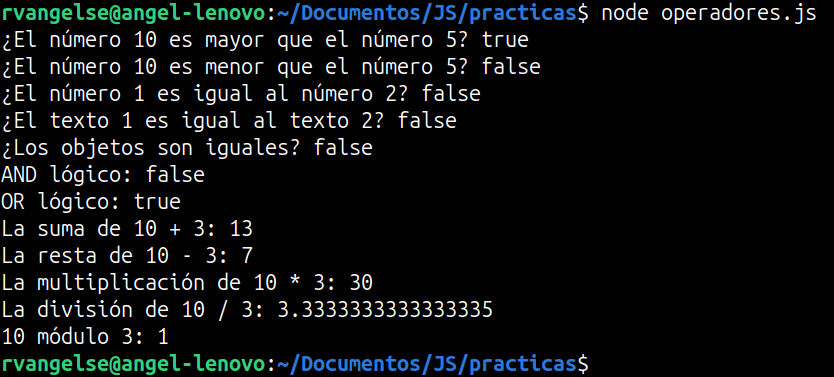
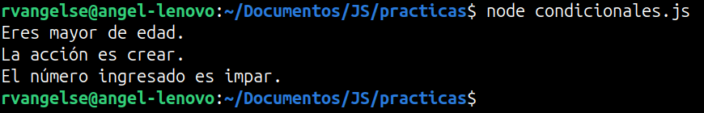

# Estructuras de Control y Lógica

## Operadores

### Operadores de comparación
```js
const a = 10;
const b = 5;
const c = "10"; 

//El operador == solo compara valores
console.log(a == c); //True
```
OJO: Existe el operador `!==` es el contrario de `===`

OJO: En JS, tambien se puede comparar texto, según su `orden alfabético`. Las `mayúsculas` están antes que las `minúsculas`.

### Comparaciones valor / referencia

**Comparación por valor**

En JS, comparar por `valor` significa comparar el `contenido de las variables`

Ejemplo:
```js
let x = 10;

let y = 10;

console.log(x == y); // true
```
**Comparación por referencia**

En JS, comparar por `referencia` significa comparar si las variables `apuntan al mismo objeto en memoria`

Ejemplos: 
```js
// Comparación por referencia (con objetos de igual contenido)
let a = {valor: 10};
let b = {valor: 10};
// No apuntan a la misma posición de memoria
console.log(a == b); // false
console.log(a === b); // false

// Comparación por referencia (con el mismo objeto)
let c = {valor: 10};
let d = c;
// Apuntan a la misma posición de memoria
console.log(c == d); // true
console.log(c === d); // true
```
### Operadores aritméticos
```js
console.log(3 + 4); //suma
console.log(3 - 4); //resta
console.log(3 * 4); //multiplicación 
console.log(12 / 4); //división
console.log(12 % 7); //módulo

//Trucos
//Todo esto es lo mismo, escrito de otra forma:
let a = 10;
a = a + 1;
//Importa el orden de los operadores, suman y luego asignan
a += 1; 
++a; 
```
### Operadores lógicos
```js
a == b || a == c; 
a == c && a != b; 
a == c && !(a == b); //El operador ! es la negación
```
## Práctica 2: Operadores en JS

**Código**
```js
array1 = [10, 1, "texto 1"];
array2 = [5, 2, "texto 2", 3];

console.log(`¿El número 10 es mayor que el número 5? ${array1[0] > array2[0]}`);
console.log(`¿El número 10 es menor que el número 5? ${array1[0] < array2[0]}`);
console.log(`¿El número 1 es igual al número 2? ${array1[1] == array2[1]}`);
console.log(`¿El texto 1 es igual al texto 2? ${array1[2] == array2[2]}`);
console.log(`¿Los objetos son iguales? ${array1 == array2}`);
console.log(`AND lógico: ${(array1[0]>array2[0]) && (array1[0]<array2[0])}`);
console.log(`OR lógico: ${(array1[0]>array2[0]) || (array1[0]<array2[0])}`);
console.log(`La suma de 10 + 3: ${array1[0] + array2[3]}`);
console.log(`La resta de 10 - 3: ${array1[0] - array2[3]}`);
console.log(`La multiplicación de 10 * 3: ${array1[0] * array2[3]}`);
console.log(`La división de 10 / 3: ${array1[0] / array2[3]}`);
console.log(`10 módulo 3: ${array1[0] % array2[3]}`);
```

**Output**
<p align="center">
  
</p>

## Condicionales 

### if, else, else if
```js
let numeroAleatorio = (Math.random() * 10).toFixed(0); 
/* El metodo Math.random() genera flotantes aleatorios, la mayoria de veces entre 0 y 1, 
   para modificar eso, hice lo de arriba. Con esto, obtengo enteros aleatorios entre 0 y 10. */

if (numeroAleatorio >= 4) {
    console.log("El numero es " + numeroAleatorio + " y es mayor o igual que 4");
}else if (numeroAleatorio >= 2) { 
    console.log("El numero es " + numeroAleatorio + " y es mayor o igual que 2");
}else {
    console.log("El numero es " + numeroAleatorio + " y es menor que 2");
}
```
OJO: La cantidad de `else if` se puede extender al número de condiciones que quisieramos.

### switch
```js
let dia = "Viernes";

switch(dia){          
    
    case "Lunes":
    case "Martes":
    case "Miércoles":
    case "Jueves":
        console.log("No es fin de semana");
        break;

    case "Viernes":
    case "Sabado":
    case "Domingo":
        console.log("Es fin de semana");
        break;

    default:
        console.log("No es un dia de la semana");
};
```
OJO: Puedes crear el número de `cases` que necesites.

### Ternarios 

```js
let numero = 3;
let resultado = (numero >= 0) ? 'Es positivo': 'Es negativo';
```
## Práctica 3: Condicionales en JS

**Código**
```js
let edad = 18; 
let accion = 1;
let numero = 3;

if (edad >= 18){
    console.log("Eres mayor de edad.");
}

switch (accion){
    case 1 :
        console.log("La acción es crear.");
        break;
    default:
        console.log("La acción es eliminar.");
}

let resultado = (numero % 2 == 0)? 
"El número ingresado es par.": 
"El número ingresado es impar.";
console.log(resultado);
```
**Output**
<p align="center">
  
</p>