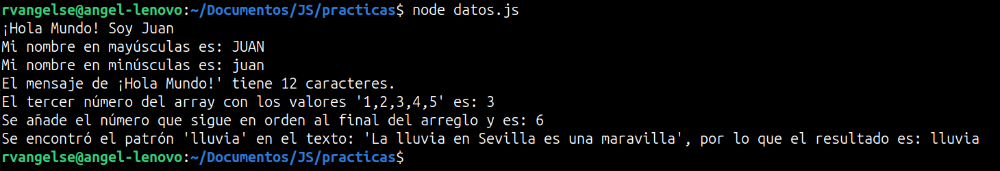

# Variables y tipos de datos

## Variables

```js
//Forma clásica de declarar una variable y asignarle un valor           
var nombre = "Angel"; 

//let a diferencia de var, declara una variable local (Esta es la forma moderna y más optima)
let edad = 22; 

const añoDeNacimiento = 2002; //Constante

let presentacion1 = "Mi nombre es " + nombre;
let presentacion2 = "y naci en el año " + añoDeNacimiento;
```
OJO: Es una buena práctica declarar las variables y constantes al `inicio` del programa, individualmente.

OJO: Estas son las [palabras reservadas](https://developer.mozilla.org/es/docs/Web/JavaScript/Reference/Lexical_grammar#palabras_clave) por JS.

OJO: Evita el uso indiscriminado de variables globales, opta por `variables locales` dentro de las funciones siempre que sea posible. 

## Strings y sus métodos

```js
//Concatenación 
//Forma 1
let presentacionUno = `${presentacion1} ${presentacion2}`; 
//Forma 2
let presentacionDos = presentacion1 + " " + presentacion2; 
console.log(presentacionUno);

//Conversión a minúsculas
console.log(presentacionUno.toLowerCase()); 

//Conversión a mayúsculas
console.log(presentacionDos.toUpperCase()); 

//Longitud 
console.log("La frase de arriba esta compuesta por " + presentacionDos.length + " caracteres");

//Armar substrings
console.log(presentacionDos.substring(13, 18)); 
//OJO: El inicio es no inclusivo, queria tomar desde el char 14 al 18

//Verifica si un subtexto esta incluido en otro
console.log(presentacion1.includes("Angel"));
```
OJO: `\` sirve para que JS renderice un carácter como texto. 
Por otro lado `\n` sirve para crear un salto de línea.

## Numbers
```js
const numeroNC = 5e3; //Se puede expresar numeros en notacion cientifica
const infinito = Infinity //Se puede asignar el valor "infinito"
const modulo = 10 % 2; 
const potencia = 2 ** 2; 
console.log(potencia);

/*Existen problemas con la precision de las operaciones aritmeticas usando flotantes, esto se corrige usando el toFixed() */
const sumaFlotante = 0.1 + 0.2;
const resSumaFlotante = sumaFlotante.toFixed(1); //El metodo .toFixed(), indica la cantidad de decimales que devolvera el res
console.log(resSumaFlotante); 
console.log(resSumaFlotante === 0.3); 

//Uso del Objeto "Math", es una librería.
const raizCuadrada = Math.sqrt(16);
const valorAbsoluto = Math.abs(-15);
const numeroRandom = Math.random();
console.log(raizCuadrada);
console.log(valorAbsoluto);
console.log(numeroRandom);
```
OJO: La cantidad de decimales que se pueden usar en JS está `acotada`.

OJO: El `===` sirve para comparar valores y tipos de datos, simultáneamente.

OJO: Por alguna razón la implementación del `.toFixed()` en JS, convierte el dato de `number` a `string`.

OJO: Existe el valor `NaN`, significa que una variable no es un número.

## Arrays y sus métodos

En JS, los arrays son objetos.

```js
//Introducción a Arrays
const frutas = Array("Naranjas", "Mangos", "Manzanas");
console.log(frutas);

const frutas2 = ["Naranjas", "Mangos", "Manzanas"];
console.log(frutas2);

const vacio = [];
console.log(vacio);

const primeraFruta = frutas[0];
const cantidadFrutas = frutas2.length;
console.log(primeraFruta);
console.log(cantidadFrutas);

const frutas3 = Array(3)
frutas3[0] = "Naranjas";
frutas3[1] = "Mangos";
frutas3[2] = "Manzanas";

console.log(frutas3);

let listaRandom = [1, 'Lunes', true, {}, [false]]; //Pueden contener distintos tipos de datos, simultáneamente
console.log(listaRandom[4][0]); //Se puede iterar arrays de forma anidada

let abecedario = ['c', 'b', 'a', 'z', 'y', 'm'];

//Métodos
console.log(Array.isArray(abecedario)); //Comprueba si un objeto es un array
console.log(abecedario.sort()); //Ordena 
console.log(abecedario.includes('q')); //Funciona como un "pertenece"

const frutasPush = frutas.push("Sandias", "Piñas"); //Agrega elementos al final y devuelve la longitud
console.log(frutas);
console.log(frutasPush);

const frutasPop = frutas.pop(); //Elimina el ultimo elemento y lo devuelve
console.log(frutasPop);
console.log(frutas);

abecedario.unshift('x'); //Agrega elementos al inicio y devuelve la nueva longitud

abecedario.shift(); //Elimina el primer elemento y lo devuelve

const frutasNuevas = frutas.concat(["Uvas", "Kiwis"]); //Concatena un array con otro, sin modificar el array original

console.log(frutas); 
console.log(frutasNuevas);

abecedario.splice(1,2); //Elimina los "Y" elementos desde un "X". En este caso elimina 2 elementos, a partir del indice 1.

//Iteración con .map() y .forEach()
const numeros = [2, 3, 5, 8]
const numerosAlCuadrado = numeros.map(numero => numero * numero); // Genera un nuevo array que contiene los resultados de aplicar una funcion a cada uno de los elementos del array original                                                        
console.log(numeros);
console.log(numerosAlCuadrado);

const colores = ["rojo", "azul", "verde"];
const coloresIterados = colores.forEach(color => console.log(color)); // Aplica una funcion a cada uno de los elementos del array. No genera un nuevo array. 

console.log(colores);

//Filtrado y reducción 
const numerosPares = numeros.filter(numero => numero % 2 == 0);
console.log(numerosPares);

const sumatoria = numeros.reduce((acumulador, valorActual) => acumulador + valorActual, 0); //Es una especie de fold
console.log(sumatoria);

const palabras = ["manzana", "banana", "hola", "chao", "banana", "chao", "chao"];
const frecuenciaPalabra = palabras.reduce((acumulador, valorActual) => {
    if (acumulador[valorActual]) {
        acumulador[valorActual]++;
    } else {
        acumulador[valorActual] = 1;
    }
    return acumulador;
}, {});

console.log(frecuenciaPalabra);

/* OJO: Pasa algo raro aca, JS trata al "acumulador" como un objeto y a cada elemento del array como un atributo
        de este objeto. */

//Búsqueda de elementos 

//.find() (Te devuelve el primer elemento de un array que cumple la condicion que le pasas como input)
const numeroImpar = numeros.find(numero => numero % 2 == 1);
console.log(numeroImpar);

//.findIndex() (Te devuelve la posicion del primer elemento de un array que cumple la condicion que le pasas como input)
const indiceNumeroImpar = numeros.findIndex(numero => numero % 2 == 1);
console.log(indiceNumeroImpar);
console.log(numeros[indiceNumeroImpar]);

//Crear copias con .slice()
const animales = ["hormiga", "vaca", "pato", "perro", "gato"];
const animales2 = animales.slice(); //Crea una copia completa del array original
const animalesCopia = animales.slice(0, 3); //No incluye el indice del final, es decir, aqui copia del indice 0 al 2.
const animalesCopia2 = animales2.slice(-2); //Cuenta del ultimo al primero (Forma inversa) 
//OJO: Puedes pasarle solo un parametro, hara referencia al final del intervalo

console.log(animales);
console.log(animales2);
console.log(animalesCopia);
console.log(animalesCopia2);

//Spread operator: casos de uso

//Crear copia de un array
const animales3 = [...animales];
console.log(animales3);

//Combinar arrays y agregar elementos
const animales4 = [...animales, "elefante",...animales2];
console.log(animales4);

//Pasar argumentos como arrays a funciones
function suma(a, b, c, d) {
    return a + b + c + d;
};

console.log(suma(...numeros));
```
OJO: Evita modificar una lista mientras la estás iterando. En su lugar, crea un nuevo array o utiliza índices para cambiar los valores.

OJO: Casi todos los métodos no modifican al array original, sino que crean uno nuevo. Por lo tanto, siempre asigna el resultado de estos métodos a una nueva variable o al mismo array para mantener las modificaciones.

## Expresiones Regulares (Regex)
Son patrones que permiten encontrar coincidencias en cadenas de texto, se usan para buscar y manipular texto de manera eficiente.

```js
let texto1 = "Me encanta la música de Charly García.";
let texto2 = "me encanta la música de Led Zeppelin.";
let texto3 = "encanta la música de Calle 13.";
let texto4 = "la música de Meshuggah.";
let texto5 = "música de Daft Punk.";
let texto6 = "Me gusta Diplo.";
let texto7 = "No me gusta Diplo.";

let regex = /Zeppelin.$/i; //Busca textos que tengan "Zeppelin." al final
let regex1 = /^Me/; // Busca textos que tengan "Me" al inicio
//OJO: Si añado "i" al final, no diferencia entre minúsculas y mayúsculas

console.log(regex.test(texto1));
console.log(regex.test(texto2));
console.log(regex.test(texto3));
console.log(regex.test(texto4));
console.log(regex.test(texto5));
console.log(regex.test(texto6));
console.log(regex.test(texto7));
```
## Objetos
En JS, todo es un objeto. Los objetos son como diccionarios clave-valor.
Son perfectos para modelar el mundo real.
```js
let carro = {
    marca: "Ford",
    modelo: "Mustang",
    color: "rojo"
};

let objeto = { 
    numero: 1, 
    texto: 'texto', 
    'lista': [], 
    boolean: true, 
    objeto: { //Objeto anidado
        objeto2: 'Hola'
    } 
};

delete objeto['objeto']; //Elimina un atributo del objeto

let usuario = {
    nombre: 'Angel',
    apellidos: 'Reyes',
    alias: 'rvangelse',
};

let usuario2 = JSON.parse(JSON.stringify(usuario)); //Con eso estoy pasando el objeto por "valor", es decir, cree una copia del objeto original.
usuario2.alias = 'Programador'; //Solo modifique la copia que hice antes
console.log(usuario);
console.log(usuario2);
```
OJO: Al asignarle un objeto a una variable, lo estas pasando por `referencia`.

## Tipos de datos
JS es un lenguaje tipado dinámicamente (Tipado debil), por lo que no tienes que especificar el tipo de dato de una variable cuando la declaras. 

Los tipos de datos se convierten automáticamente según sea necesario durante la ejecución del script.

```js
console.log(typeof(presentacionUno)); //El typeof(), me devuelve el tipo de dato del input

//Primitivos:
let string = 'texto';
let number = 3.534;
let bool = true;
let undefined; 
let bigInt = BigInt(34565988745762345762345786);
let symbol = Symbol('Symbolo');
//OJO: El tipo symbol se usa para crear variables que tienen asignado como valor un “símbolo único” 

//Estructurales:
let object = { 0: 'Xavier' };
let array = ['Xavier']; 
let regex = /asd/; 
let function saludar(nombre) {
    console.log("Hola, " + nombre);
    };
saludar(nombre);

//Raiz Estructural-Primitivo
let nulo = null;

//Conversion de Tipos
//Explicita:
const stringBinario = "10000";
const numberDecimal = parseInt(stringBinario, 2); //Conversion de string (binario) a number (decimal) 

const numberDecimal2 = 16;
const stringBinario2 = numberDecimal2.toString(2); //Conversion de number (decimal) a string (binario)
console.log(binarioReal);

const string = "42";
const integer = parseInt(string); //Conversion de string a number (Int)
const integer2 = parseFloat(string); //Conversion de string a number (Float)
console.log(typeof(integer));
console.log(typeof(integer2));

//Implicita: 
const resSumaString = "3" + 2; //Convierte el number a string y lo concatena
console.log(resSumaString);
const resSumaBool = 7 + true; //Convierte al boolean en number (1) y los suma
console.log(resSumaBool); 
```
OJO: La diferencia entre el tipo `null` y el tipo `undefined` es que usamos el tipo null para señalar que una variable no tiene `ningún` valor asignado y por otro lado el tipo undefined, señala que una variable tiene un valor asignado, `no definido`.

## Práctica 1: Variables y tipos de datos en JS 

**Código**
```js
let saludo = "¡Hola Mundo!";
let nombre = "Juan";

let array = [1, 2, 3, 4, 5];
array.push(6);

let texto = "La lluvia en Sevilla es una maravilla.";
let patron = /lluvia/;
let resultado = texto.match(patron);

console.log(`${saludo} Soy ${nombre}`);
console.log(`Mi nombre en mayúsculas es: ${nombre.toUpperCase()}`);
console.log(`Mi nombre en minúsculas es: ${nombre.toLowerCase()}`);
console.log(`El mensaje de ¡Hola Mundo!' tiene ${saludo.length} caracteres.`);
console.log(`El tercer número del array con los valores '1,2,3,4,5' es: ${array[2]}`);
console.log(`Se añade el número que sigue en orden al final del arreglo y es: ${array[array.length - 1]}`);
console.log(`Se encontró el patrón 'lluvia' en el texto: 'La lluvia en Sevilla es una maravilla', por lo que el resultado es: ${resultado}`);
```

**Output**
<p align="center">
  
</p>