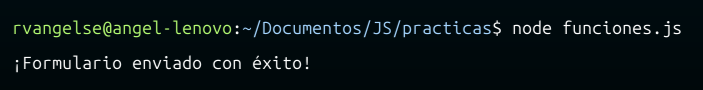

# Funciones
Se pueden pensar como un `paquete de código` `reutilizable` que ejecuta una `funcionalidad`.

## Declaración de funciones

```js
//Le puedes dar argumentos iniciales (default) a tu función 
function sumar(a = 0,b = 0) {
    return a + b;
}

//Función dinámica, sirve para n-argumentos
function sumar() {
    let suma = 0;
    for (let numero of arguments) {
        suma += numero;
    }
    return suma;
}
console.log(sumar(1,2,3,4,5,6,7,8));

//Funcion que recibe objetos
function imprimirCliente () {
    console.log("Mi nombre es " + this.nombre + " y tengo " + this.edad + " años")
};

const clienteA = {
    nombre: 'Luis',
    edad: 21,
};

imprimirCliente.call(clienteA); //El metodo call le pasa un objeto como argumento a una funcion
```
OJO: Los `parámetros` son los `nombres genéricos` que le asignamos a una función al declarla, por otro lado, los `argumentos` son los `valores` que les asignamos a esos parámetros al invocar a la función.

OJO: Las `declaraciones` de funciones se cargan antes de que se ejecute cualquier código, por lo que puedes llamarlas desde `cualquier lugar` en tu código. 

## Expresión de una función

Son funciones como `variables`.

```js
let multiplicar = function(a,b){
    console.log(a*b);
}
```
OJO: Las `expresiones` de funciones no se cargan hasta que el intérprete llega a esa línea de código, por lo que si intentas llamar a una expresión de función `antes de que se defina`, obtendrás un `error`.

## Retorno
En JS, las funciones `pueden` o `no` devolver un valor. 

```JS
//No devuelve nada
function sumar(a,b) {
    console.log(a + b);
}

let usuario = {
    nombre: 'Ana',
    apellido: 'Perez'
};

//Devuelve una copia mutada del objeto "usuario"
function cambiarApellido(objecto) {
    let copia = JSON.parse(JSON.stringify(objecto));
    copia.apellido = 'Ochoa';
    return copia;
}

console.log(cambiarApellido(usuario));
console.log(usuario);
```
## Métodos
Son funciones asociadas a un objeto específico.

```js
let rocket = {
    name: "Falcon 9",
    conteo: function conteo(){
        for (let i = 5; i >= 0; i--) {
            console.log("Lanzamiento en " + i);
            
            if (i == 0){
                console.log('🔥🔥LANZAMIENTO!!!!!!!!!!!!!!!!!!!');
                
            }
            
        }
    }
}

rocket.conteo();
```
## Ambito
```js
var numero = 4; //Variable global

function ejemplo() {
    let numero = 10; //Variable local
    console.log(numero);
}

ejemplo(); //10
console.log(numero); //4
```
OJO: Evita usar `var` para declarar variables en JS, ya que su alcance es `global` o `de función entera`, lo cual puede llevar a problemas de sobrescritura o acceso no intencionado. En cambio, utiliza `let` que tiene un `alcance de bloque`, proporcionando un mayor control sobre dónde se puede acceder o modificar una variable.

OJO: Se puede acceder a variables `locales` desde el contexto `global`, pero no al réves.

OJO: En JS, las `{}` indican el inicio y fin de un bloque de código.

## Callback 
Es pasar una `función como argumento` de otra función.

```js
//Funcion con dos funciones como parámetros
function llamar(enExito, enError) {
    let exito = true;
    
    if (exito) {
        enExito(); //Invoco la primera 
    } else {
        enError(); //Invoco la segunda
    }
}

llamar(
    function() { console.log('Exito'); },
    function() { console.log('Error'); }
);

//Funcíon que devuelve una nueva función
function intercambiar (funcion, a, b){
    return funcion(b, a); //Funcion como output
};

console.log(intercambiar(resta, 5, 3));
```
## Funciones flecha (Arrow)

```js
const sumar = (a,b) => a+b;

const personaje = {
    nombre: "Luis",
    saludo: function (nombre2) {
        console.log(`Hola, ${nombre2}! Mi nombre es ${this.nombre}`);
    },
    saludoArrow: (nombre2) => {
        console.log(`Hola, ${nombre2}! Mi nombre es ${personaje.nombre}`);
    }
};

personaje.saludo("Angel");
personaje.saludoArrow("Angel");
```
OJO: Las `funciones flecha` no cuentan con enlace léxico, es decir, no reconocen el contexto del objeto referenciado, si se las usa dentro de un método. Por esta razón, use `personaje.nombre`, en lugar de `this.nombre`.

## Closures

Son funciones internas que capturan parametros del ambito local de su funcion externa.

```js
function crearCajaDeAhorros() {
    let dinero = 0; 
  
    return function agregarDinero(monto) {
      dinero += monto;
      console.log(`Tienes ahora $${dinero} en tu caja de ahorros.`); /* Clousure "agregarDinero", captura la variable
                                                                        "dinero". */
    };
  };
  
  const miCaja = crearCajaDeAhorros();  
  miCaja(50);  
  miCaja(30);  
```
OJO: El objetivo de usar closures es poder aislar la lógica de una función y evitar que sus variables locales sean modificadas.

## Funciones puras e impuras

**Funciones puras**

Son funciones que dada una `misma input devuelve siempre el mismo output`.
Por lo tanto, `no` se producen `efectos secundarios`. 

Podemos usar el `paradigma funcional` con este tipo de funciones.

```js
function square(x){
    return x * x;
};

function addTen (y) {
    return y + 10;
};

const number = 5;
const finalRes = addTen(square(number)); //Una composicion entre funciones puras, es una funcion pura. 
console.log(finalRes);
```
**Funciones impuras**

Son funciones que producen efectos secundarios, como: 
   - Modificar variables globales 
   - Modificar parametros de una funcion 
   - Solicitudes HTTP (APIs) 
   - Imprimir mensajes en pantalla o en consola 
   - Manipulacion del DOM
   - Obtener la hora o el dia actual

```js
function sum (a, b) {
    console.log("a: " + a);
    return a + b;
};

console.log(sum(5, 3)); 
```

## Práctica 5: Funciones en JS

**Código**
```js
let datosValidos  = (nombre, email, mensaje) => {
    return nombre && email && mensaje;     
}

function enviarFormulario (nombre, email, mensaje) {
    if(datosValidos(nombre, email, mensaje)){
        console.log("¡Formulario enviado con éxito!");
    } else {
        console.log("Por favor, completa todos los campos.");
    }
}

const nombre = "Angel"
const email = "angel@gmail.com"
const mensaje = "Hola, mundo!"

enviarFormulario (nombre, email, mensaje);
```
**Output**

<p align="center">
  
</p>