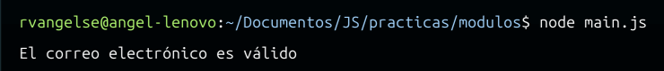

# Módulos
## Exportar 

```js
export function sumar(a, b) {
    return a + b;
}

export const PI = 3.14;

export class Servicio {

    tres = 3;

    restarTres(num) {
        return num - this.tres;
    }
}

export default Servicio;
```
## Importar

```js
//Importa sumar, PI y Servicio del archivo export.js
import { sumar, PI, Servicio } from './export.js';

let resultado = sumar(1,2);
console.log(resultado);
console.log(PI);
const servicio = new Servicio();
console.log(servicio.restarTres(PI));

//Importa Servicio por default
import cualquierNombre from './export.js';

console.log(new cualquierNombre().restarTres(4));

//Importa todo lo que se pueda importar desde export.js
import * as todo from './export.js';

console.log(todo.sumar(4,5));
console.log(todo.Servicio);
```
OJO: Al importar módulos y correrlos con `NodeJS`, debes crear un `archivo.json`. Para esto usa el siguiente comando, en tu carpeta principal:
```sh
    npm init
```
OJO: Evita importar de más. En lugar de importar un paquete o módulo completo, trata de importar solo funciones o componentes específicos que necesites.

## Pŕactica 8: Módulos en JS

**Código**
```js
export function validarCorreo(correo){
    //Forma de un correo usando expresiones regulares
    const patronCorreo = /^[^\s@]+@[^\s@]+\.[^\s@]+$/;
    return patronCorreo.test(correo);
}
```
```js
import { validarCorreo } from "./validarCorreo.js";

let correo = "rvangelse@gmail.com"

if (validarCorreo(correo)){
    console.log("El correo electrónico es válido")
}else{
    console.log("El correo electrónico es válido")
}
```
```json
{
  "name": "modulos",
  "version": "1.0.0",
  "description": "Modulo de prueba",
  "main": "main.js",
  "scripts": {
    "test": "echo \"Error: no test specified\" && exit 1"
  },
  "author": "Angel Reyes V.",
  "license": "MIT",
  "type": "module"
}
```
**Output**

<p align="center">
  
</p>
