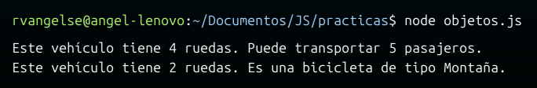
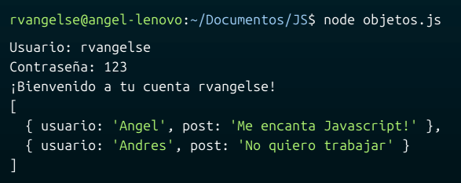

# Programación orientada a objetos (POO)
Un `objeto` es una estructura de datos que nos permite almacenar informacion de la forma `atributo - valor`

En JS, todos los objetos heredan atributos y métodos del prototype `Object()`

## Contexto
`this.` es el contexto de un objeto, lo usamos para hacer referencia a la instancia/objeto actual.

```js
let personaje = {
    nombre: "John",
    edad: 25,
    arma: "Escopeta",
    mostrarInformacion: function(){//Esto es un método, una función que nos permite interactuar con el objeto
        console.log("Nombre: " + this.nombre);
        console.log("Edad: " + this.edad);
        console.log("Arma: " + this.arma);
    }
};

personaje.mostrarInformacion();

personaje.elemento = "fuego"; //Agrego un nuevo atributo al objeto "personaje", tambien se puede agregar métodos, de esta forma
console.log(personaje.elemento); 

delete personaje.elemento; //Asi se borran atributos/metodos
console.log(personaje);  
```
## Getter y Setter
En JS, puedes existen palabras reservadas que te permitirán construir los getters y setters de tus objetos.
```js
let persona = {
	_nombre: '',
	_edad: 0,
    get datos(){
        return this._nombre + '' + this._edad;
    },
    set datos(valor){
        const splitValor=valor.split('');
        this._nombre=splitValor[0];
        this._edad=splitValor[1];
    }
};
```
OJO: Utiliza getters y setters cuando necesites agregar lógica adicional o validación durante la obtención o asignación de un valor.

## Vinculación

Puedes vincular una función a varias objetos, con el fin de reutilizarla, en lugar de crear varios métodos.

```js
function info(a) {
    console.log(this, a);
}

let auto = {
    modelo: 'Modelo 3',
    año: 2021,
    marca: 'Tesla'
};

info.bind(auto)(); //Vincula a info solo a 1 objeto
info.call(auto, 10, 20); //Vincula a info a varios objetos, separados con ","
info.apply(auto, [10, 20]); //Vincula a info a varios objetos en un array
```
OJO: Cuando usamos `.call` o `.apply`, el primer argumento debe ser un objeto, si no tenemos uno, podemos pasar `null`

## Constructores
Son funciones que te permiten crear nuevos objetos, a partir de ellas.

```js
function Perro(nombre) {
    this.nombre = nombre;    
    this.modelo = modelo;
    this.año = año;
    this.marca = marca;
}

//En este caso, en lugar de crear este método para cada instancia de Auto, lo asignamos como común a todas. Esto evita que se repita el código de forma innecesaria.
Auto.prototype.info = function() { 
    return this.modelo + " - " + this.marca + " - " + this.año;
}

const auto1 = new Auto('Modelo 3', 2021, 'Tesla');
const auto2 = new Auto('Hummer EV', 2022, 'GMC');

console.log(auto1.info());
console.log(auto2.info());
```
## Clases 
Son azúcar sintáctica para crear plantillas de objetos, las usamos en lugar de las funciones constructoras.

```js
class Auto {
    //Constructor
    constructor(modelo, año, marca) {
        this.modelo = modelo;
        this.año = año;
        this.marca = marca;
    }

    info() {
        return this.modelo + " - " + this.marca + " - " + this.año;
    }
}

const auto1 = new Auto('Modelo 3', 2021, 'Tesla');
const auto2 = new Auto('Hummer EV', 2022, 'GMC');

console.log(auto1.info());
console.log(auto2.info());
```
OJO: No uses clases si no las necesitas. Crear un objeto directamente puede ser más eficiente y simple.

OJO: Las `clases/funciones constructoras` son las únicas que generan prototipos. Un prototipo es la "herencia" en si. 
## Herencia

```js
//Creo una función constructora para la clase Padre
function Padre(nombre, apellido) {
    this.nombre = nombre;
    this.apellido = apellido;
}

//Le añado un método saludo
Padre.prototype.saludo = function() {
    console.log(`Soy ${this.nombre} ${this.apellido}`);
}


//Creo una función constructora para la clase Hijo
//Reutilizo el constructor de Padre para hijo
function Hijo(nombre, apellido) {
    Padre.call(this, nombre, apellido);
}

//Le heredo el método saludo de Padre 
Hijo.prototype = Padre.prototype;
```

## Extender
Podemos simplificar mucho más la herencia con el concepto de clases, antes mencionado.

```js
class Animal {
    constructor(nombre, tipo){
        this.nombre = nombre;
        this.tipo = tipo;
    };
    emitirSonido(){
        console.log("El animal emite un sonido");
    };
};

class Perro extends Animal {
    constructor(nombre, tipo, raza){
        super(nombre, tipo); //Estoy usando el constructor heredado de la clase padre "Animal"
        this.raza = raza;
    };
    emitirSonido(){  //Sobreescribo el metodo heredado de la clase padre "Animal"
        console.log("El perro ladra");
    };
};

const perro = new Perro("Buddy", "Canino", "Golden Retriever");
console.log(perro);
perro.emitirSonido();
```
## Práctica 6: Objetos en JS

**Código**
```js
class vehiculo {
    constructor(cantRuedas){
        this.cantRuedas = cantRuedas;
    }
    mostrarDetalles(){
        return `Este vehículo tiene ${this.cantRuedas} ruedas.`;
    }
}

class auto extends vehiculo {
    constructor(capacidad){
        super(4);
        this.capacidad = capacidad;
    }
    mostrarDetalles(){
        return super.mostrarDetalles() + ` Puede transportar ${this.capacidad} pasajeros.`;
    }
}

class bicicleta extends vehiculo {
    constructor(tipo){
        super(2);
        this.tipo = tipo;
    }
    mostrarDetalles(){
        return super.mostrarDetalles() + ` Es una bicicleta de tipo ${this.tipo}.`;
    }
}

let auto5 = new auto(5);
let biciMontaña = new bicicleta("Montaña");

console.log(auto5.mostrarDetalles());
console.log(biciMontaña.mostrarDetalles());
```
**Output**

<p align="center">
  
</p>

## Práctica 7: Red Social 

**Código**
```js
/* Requerimientos del reto:

1. El usuario debe poder ingresar su usuario y contraseña
2. El sistema debe ser capaz de validar si el usuario y contraseña ingresados por el usuario existen en la base de datos
3. Si el usuario y contraseña son correctos, el sistema debe mostrar un mensaje de bienvenida y mostrar el timeline del usuario.
4. Si el usuario y contraseña son incorrectos, el sistema debe mostrar un mensaje de error y no mostrar ningun timeline. */

//Defino un array de objetos que usare como base de datos
const baseDeDatos = [
    {
      usuario: "rvangelse",
      contraseña: "123",
    },
    {
      usuario: "jdoe",
      contraseña: "456",
    }
  ];

//Defino otro array de objetos que usare como linea de tiempo
  const posts = [
    {
      usuario: "Angel",
      post: "Me encanta Javascript!",
    },
    {
      usuario: "Andres",
      post: "No quiero trabajar",
    }
  ];

  //OJO: Use este comando "npm install prompt-sync" para instalar el paquete que me permitio agregar inputs.
  const input = require("prompt-sync")({ sigint: true });

  const usuario = input("Usuario: ");
  const contraseña = input("Contraseña: ");
  
  //Funcion que verifica si un usuario y contraseña existen en la base de datos
  function usuarioExistente(usuario, contraseña) {
    for (let i = 0; i < baseDeDatos.length; i++) {
      if (
        baseDeDatos[i].usuario === usuario &&
        baseDeDatos[i].contraseña === contraseña
      ) {
        return true;
      }
    }
    return false;
  }
  
  function inicioSesion(usuario, contraseña) {
    if (usuarioExistente(usuario, contraseña)) {
      console.log(`¡Bienvenido a tu cuenta ${usuario}!`);
      console.log(posts);
    } else {
      console.log("Usuario o contraseña incorrectos!");
    }
  }
  
  inicioSesion(usuario, contraseña);
  ```
  **Output**

<p align="center">
  
</p>